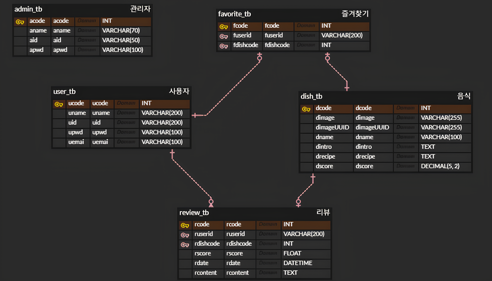

# Mono Recipe (요리 레시피 사이트)

[프로젝트 설명서 PDF](src/main/resources/PPT/MonoRecipe.pdf)

## Abstract ##
**Mono Recipe**는 사용자가 다양한 요리 레시피를 조회하고 리뷰를 남길 수 있는 요리 레시피 플랫폼입니다. 이 시스템은 관리자 서비스와 사용자 서비스를 통해 레시피 등록 및 관리 기능을 제공합니다. 사용자는 회원 가입과 로그인을 통해 개인 정보를 관리하고, 다양한 요리를 검색하며 리뷰를 작성, 수정 및 삭제할 수 있습니다. 또한, 마음에 드는 요리를 즐겨찾기에 추가하여 쉽게 관리할 수 있습니다. 관리자는 레시피를 등록, 수정, 삭제할 수 있으며, 체계적인 데이터 관리를 통해 요리 정보를 효과적으로 운영합니다. 이 프로젝트는 사용자 친화적인 인터페이스와 효율적인 데이터 관리로 사용자와 관리자가 요리에 대한 정보를 공유하고 소통할 수 있는 환경을 제공합니다.

## 🛠️ 개발 환경

- **프로그래밍 언어**: HTML, CSS, JavaScript
- **IDE**: Eclipse (jdk-11)
- **DBMS**: MySQL Database
- **SQL 툴**: DBeaver
- **버전 관리**: GitHub
- **Naver Cloud DB**: monorecipe
- **Naver Cloud Object Storage**: monorecipe-9th-bucket

## 📰 Database

- **admin_tb**: 관리자 정보 테이블
	

- **user_tb**: 회원 정보 테이블
	
	
- **dish_tb**: 요리 정보 테이블
	
	
- **review_tb**: 리뷰 정보 테이블
  

- **favorite_tb**: 즐겨찾기 정보 테이블
  
  
	
### ERD ###

## 🎰 주요 기능

### 회원 서비스

1. **회원 기능**
	- 회원 가입
	- 로그인
	- 회원정보 수정
	- 회원 탈퇴

2. **리뷰 기능**
  - 요리 조회
  - 요리 리뷰 조회
  - 요리 리뷰 작성
  - 요리 리뷰 수정
  - 요리 리뷰 삭제

### 관리자 서비스
1. **요리 관리 기능**
	- 요리 등록
	- 요리 목록 조회
	- 요리 상세 조회
	- 요리 수정
	- 요리 삭제

## 🗒️사용법
1. 사용자 가입 및 로그인:
	- 새로운 사용자는 사용자 이름, 아이디, 비밀번호, 이메일 입력하여 가입할 수 있습니다.
	- 새로운 사용자는 소셜 로그인이 가능합니다.
	- 가입된 사용자는 아이디와 비밀번호를 사용하여 로그인할 수 있습니다.

2. 요리 검색 및 선택:
	- 사용자는 관리자가 등록한 요리를 검색하고 요리의 정보를 확인할 수 있습니다.
	- 사용자 본인 및 다른 사용자가 작성한 리뷰를 확인할 수 있습니다.
	
3. 요리 리뷰 작성:
	- 사용자는 선택한 영화의 리뷰를 작성할 수 있습니다.
	- 본인이 등록한 리뷰를 수정 및 삭제할 수 있습니다.

## 🤝 기여

본 프로젝트는 오픈 소스 프로젝트로, 기여를 원하시는 분은 [GitHub 리포지토리](https://github.com/your-repo)에서 문제를 보고하거나 Pull Request를 통해 기여해 주세요.

---

이 `README.md` 파일은 `FilmNote`의 구조와 기능을 이해하는 데 도움이 될 것입니다. 필요한 경우, 추가적인 정보와 자세한 설명을 포함하여 프로젝트의 문서를 보강할 수 있습니다.

